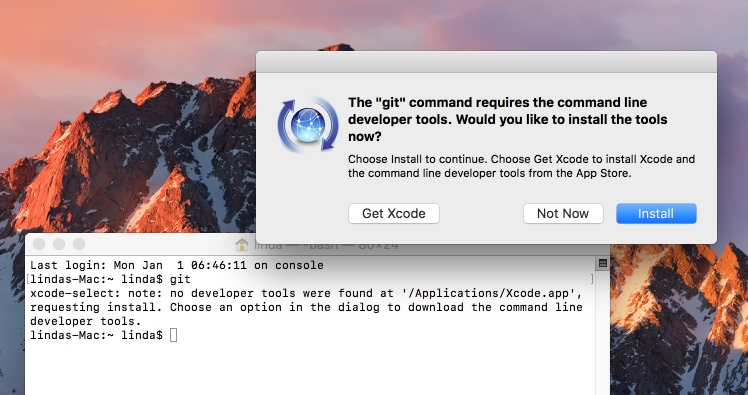
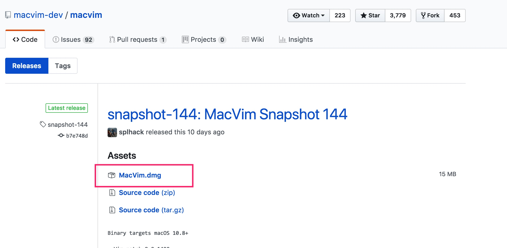

# 安装

# 1. 安装Command Line Developer Tools

如果你安装了Xcode并打开使用过，或者你很明白git、curl这些命令行工具已经安装了，那可以跳过这一步。

如果没有安装过，那可以打开Terminal.app 然后输入git回车，系统检测到没有安装Command Line Developer Tools，会提示安装，如下图：



点击Install，然后Agree就可以了。

# 2. 安装MacVim

MacVim下载地址 https://github.com/macvim-dev/macvim/releases/ ，双击MacVim.dmg后把MacVim.app拖到/Applications目录。




# 3. 清理当前vim配置

打开Terminal.app

```
rm -rf ~/.vim
rm ~/.vim*
```
（每行表示一次回车）

# 4. 安装SpaceVim

打开Terminal.app

```
curl -sLf https://spacevim.org/install.sh | bash
```


完成后运行MacVim.app


首次打开会提示选择一个模式，按键盘”1“选择第一个模式。然后，VIM会安装很多插件，等待安装完成。


我这等了16分钟（986秒）安装完成。


好了，退出MacVim，再次打开（再次打开可能有一些VIM插件更新），再次等待更新完成。（有些插件可能更新失败，目前先忽略，不影响当前教程的内容，如果需要的时候再去解决）


# 5. 命令行怎么办

如果在一个新安装的电脑上，现在命令行下还是系统自带的VIM，版本较低。

如果你需要在命令行下使用VIM，相信你可以根据这个帖子解决： https://superuser.com/questions/334252/the-best-way-to-make-macvims-vim-console-not-mvim-the-default-instead-of-mac

由于我们是通过dmg方式安装的MacVim，可以如下修改.bash_profile文件

```
alias vim="/Users/你的用户名/Applications/MacVim.app/Contents/MacOS/Vim"
```

你的用户名可以通过以下方式获得：

```
cd ~
pwd 
```


