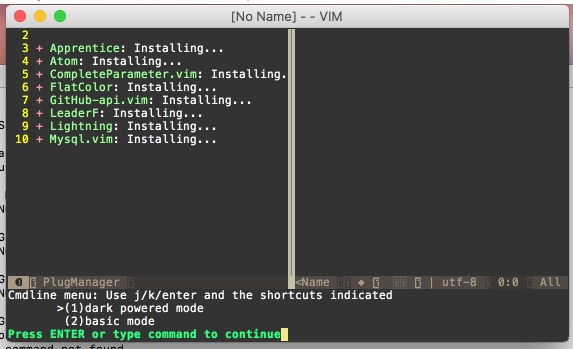
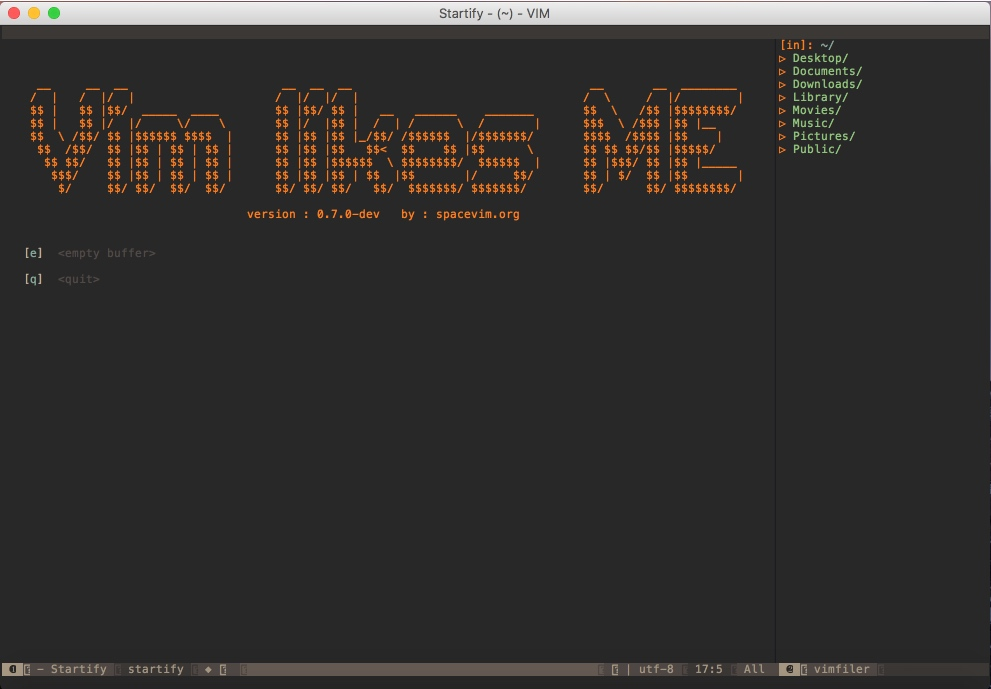

# 安装

# 1. 安装Command Line Developer Tools

如果你安装了Xcode并打开使用过，或者你很明白git、curl这些命令行工具已经安装了，那可以跳过这一步。

如果没有安装过，那可以打开Terminal.app 然后输入git回车，系统检测到没有安装Command Line Developer Tools，会提示安装，如下图：


点击Install，然后Agree就可以了。

# 2. 安装MacVim

安装的方式有很多，这次我们使用Homebrew来安装。

先安装Homebrew，打开Terminal.app，输入：

```
/usr/bin/ruby -e "$(curl -fsSL https://raw.githubusercontent.com/Homebrew/install/master/install)"
```

回车后，会提示输入密码，输入密码后，等待安装完成。

然后，安装MacVim。

```
brew install macvim
brew linkapps
```
（每行表示一次回车）

安装完成后，可以在LaunchPad看到MacVim了。


# 3. 清理当前vim配置

打开Terminal.app

```
rm -rf ~/.vim
rm ~/.vim*
```

# 4. 安装SpaceVim

打开Terminal.app

```
curl -sLf https://spacevim.org/install.sh | bash
```


完成后运行MacVim.app



首次打开会提示选择一个模式，按键盘”1“选择第一个模式。然后，VIM会安装很多插件，等待安装完成。我这等了16分钟（986秒）安装完成。


好了，退出MacVim，再次打开（再次打开可能有一些VIM插件更新），这次会更新插件，等待更新完成。（有些插件可能更新失败，目前先忽略，不影响当前教程的内容，如果需要的时候再去解决）


好了，完成。




# 5. 命令行


现在如果在Terminal.app中输入vim的话，仍然会打开系统的vim（版本较低）。输入以下命令即可在命令行使用MacVim的Terminal模式。

```
cd ~;echo "alias vim=\"mvim -v\"" >> .bash_profile; source .bash_profile
```

