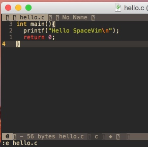
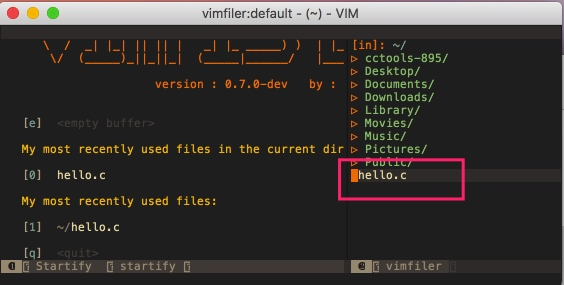

# 基本使用

之所以叫SpaceVim，就是因为很多快捷键是空格键<space>作为第一个键。

# 0. 感受空格键

打开MacVim，按下空格键，1秒后下方会出现一个提示窗口。


如果要关闭这个窗口，可以按`ESC`。

现在试试输入`空格键 字母f 字母t`（以后简称 SPC f t），可以关闭右侧的文件浏览器，再次输入`SPC f t`可以再打开。

# 1. 开始输入


打开MacVim（以后简称vim）后，有两个提示选项`e`和`q`。按下`e`会打开一个空的编辑器，按下`q`则退出vim。

现在输入`e`，然后输入一段程序：

```
int main(){
    printf("Hello SpaceVim\n");
    return 0;
}
```

输入`:w hello.c`保存。


# 2. 打开文件

重新打开vim，如果此时我们想打开一个文件，例如打开HOME目录下的hello.c文件，输入`:e hello.c`。（这都是vim基本的使用方式）


打开后如图：



# 3. 文件浏览器


现在再回到右侧的文件浏览器上，试试按下`<F3>`也可以打开关闭。也就是 `<F3>` 或者 `SPC f t`都可以打开关闭文件浏览器。

打开文件浏览器后，光标会进入文件浏览器中，这时可以输入`j`、`k`上下移动，`h`和`l`可以打开关闭文件夹。

例如下图：按`j`移动到`hello.c`后，按回车或字母`l`都可以打开`hello.c`文件。



# 3. 缓冲区管理

vim中打开的每个文件都可称为一个缓冲区（buffer），如果我们打开了多个文件，可以`SPC b b`显示列表：


此时可以输入文件名过滤，例如输入`append`，然后回车，可以切换到`append.c`的文件。

此外，这个节目还可以通过`ctrl+n`或`ctrl+p`来上下移动选择文件。

如果要当前缓冲区，可以使用`SPC b d`。


# 5. 窗口管理


SPC w / 右侧分割窗口
SPC w - 下方分割窗口
窗口左下角有编号
SPC 1 移到1号窗口(2 3 4 5 类推）
SPC w TAB 顺序切换窗口

# 6. Tab管理
SPC w F 创建新的TAB
SPC t t TAB列表
SPC w o 顺序切换TAB
或者原始方式 :tabnew 
:tab <TAB> 有提示


